<!-- Animated header: generated by scripts/gen_header.py -->

 

  
  

---

### 🛠️ Tech Stack & Toolbox

| Domain | Technologies & Tools |
| :--- | :--- |
| **Cloud & DevOps** |      |
| **Languages** |     |
| **Linux & Systems** |      |
| **Databases** |   |
| **AI & Workflow** |     |

---

<!-- Footer Wave -->

